# Features presentation

<h3 id="Editing in 3D viewport">
    <a href="#Editing in 3D viewport">
        Editing in 3D viewport
    </a>
</h3>

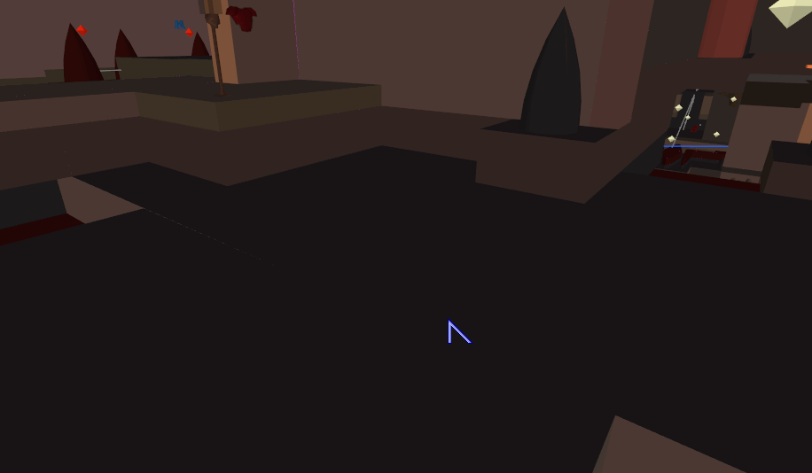

 
 

<h3 id="CGS wrap merge brushes, faces, edges, vertices, clipper points">
    <a href="#CGS wrap merge brushes, faces, edges, vertices, clipper points">
        CGS wrap merge brushes, faces, edges, vertices, clipper points
    </a>
</h3>

 
 

<h3 id="Insert brush vertices arbitrarily">
    <a href="#Insert brush vertices arbitrarily">
        Insert brush vertices arbitrarily
    </a>
</h3>

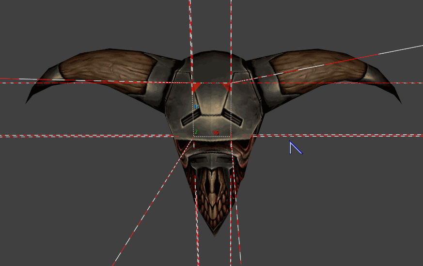

 
 

<h3 id="Delete brush vertices, edges">
    <a href="#Delete brush vertices, edges">
        Delete brush vertices, edges
    </a>
</h3>

 
 

<h3 id="Extrude brush face inside, mass extrusion of selected brush faces (ctrl + alt + m1)">
    <a href="#Extrude brush face inside, mass extrusion of selected brush faces (ctrl + alt + m1)">
        Extrude brush face inside, mass extrusion of selected brush faces (ctrl + alt + m1)
    </a>
</h3>

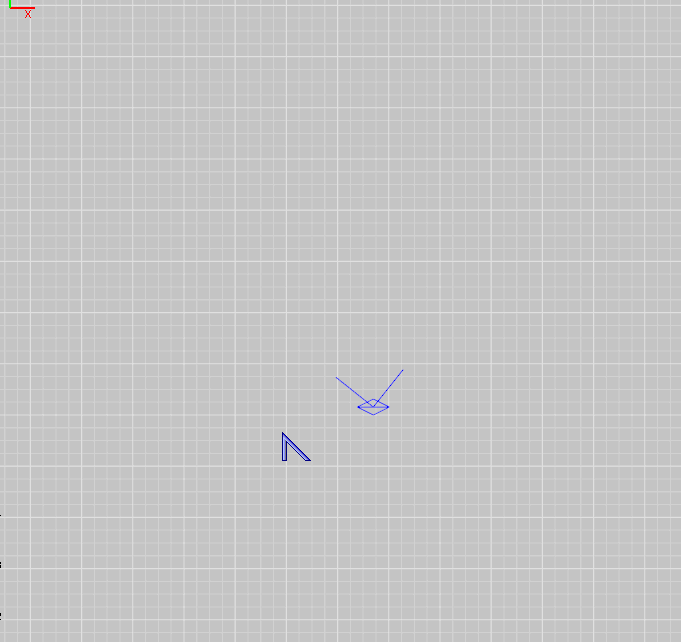

 
 

<h3 id="Simple arch creation">
    <a href="#Simple arch creation">
        Simple arch creation
    </a>
</h3>

Using extrude (ctrl + alt + m1), wrap merge (ctrl + u), direct vertex edit (alt + m1).

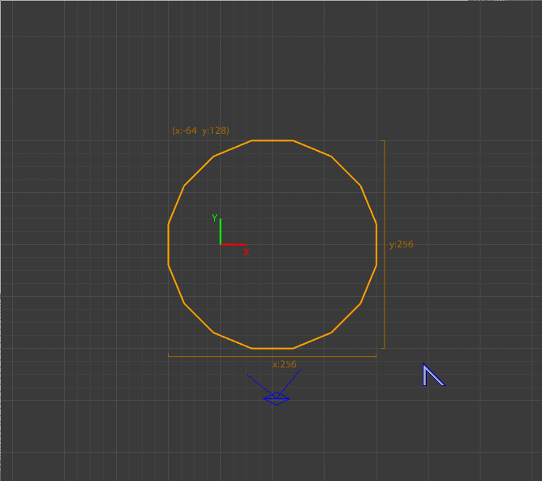

 
 

<h3 id="Mass extrusion of selected brush faces (ctrl + alt + m1)">
    <a href="#Mass extrusion of selected brush faces (ctrl + alt + m1)">
        Mass extrusion of selected brush faces (ctrl + alt + m1)
    </a>
</h3>

 
 

<h3 id="Texture UV lock during vertex editing, transforms repeating (ctrl + r)">
    <a href="#Texture UV lock during vertex editing, transforms repeating (ctrl + r)">
        Texture UV lock during vertex editing, transforms repeating (ctrl + r)
    </a>
</h3>

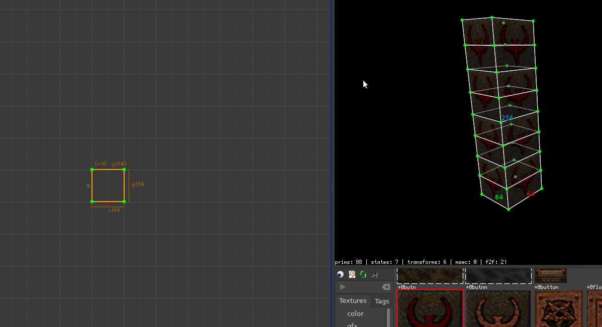

 
 

<h3 id="UV Tool on brush faces, copy, paste texture seamlessly (m3, ctrl + m3)">
    <a href="#UV Tool on brush faces, copy, paste texture seamlessly (m3, ctrl + m3)">
        UV Tool on brush faces, copy, paste texture seamlessly (m3, ctrl + m3)
    </a>
</h3>

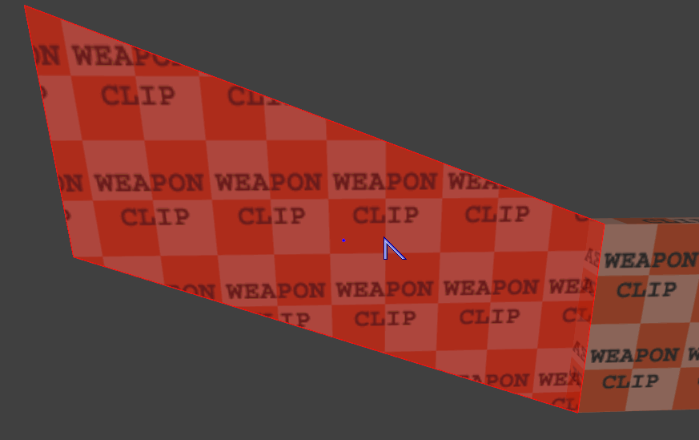

 
 

<h3 id="Brush <-> patch seamless texture paste (m3, ctrl + m3)">
    <a href="#Brush <-> patch seamless texture paste (m3, ctrl + m3)">
        Brush <-> patch seamless texture paste (m3, ctrl + m3)
    </a>
</h3>

 
 

<h3 id="UV Tool on curve">
    <a href="#UV Tool on curve">
        UV Tool on curve
    </a>
</h3>

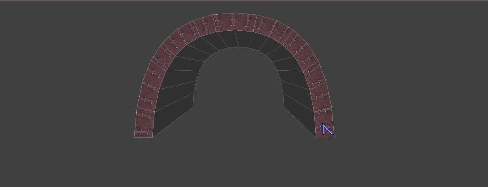

 
 

<h3 id="Some editing techniques">
    <a href="#Some editing techniques">
        Some editing techniques
    </a>
</h3>

 
 

<h3 id="Use of curve.thicken">
    <a href="#Use of curve.thicken">
        Use of curve.thicken
    </a>
</h3>

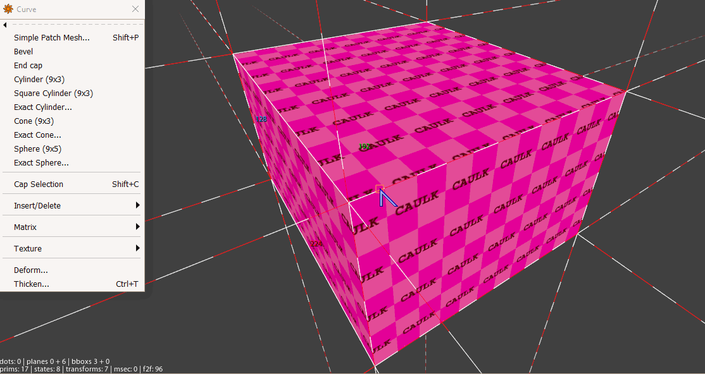

 
 

<h3 id="Brush.autocaulk">
    <a href="#Brush.autocaulk">
        Brush.autocaulk
    </a>
</h3>

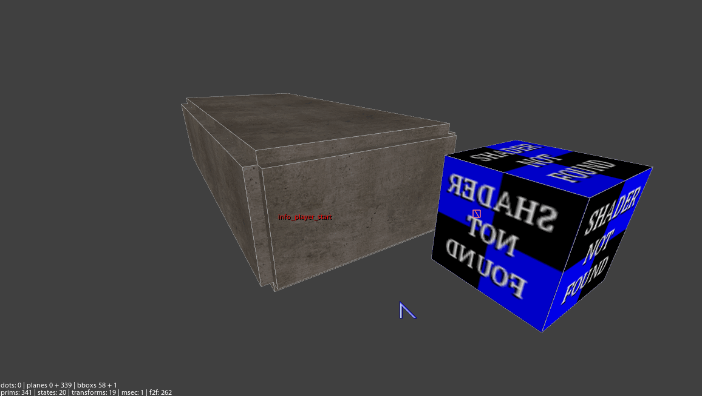

 
 

<h3 id="Creating curve of brushes (extrude, merge)">
    <a href="#Creating curve of brushes (extrude, merge)">
        Creating curve of brushes (extrude, merge)
    </a>
</h3>

 
 

<h3 id="Bending patch pipe by Transform tool">
    <a href="#Bending patch pipe by Transform tool">
        Bending patch pipe by Transform tool
    </a>
</h3>

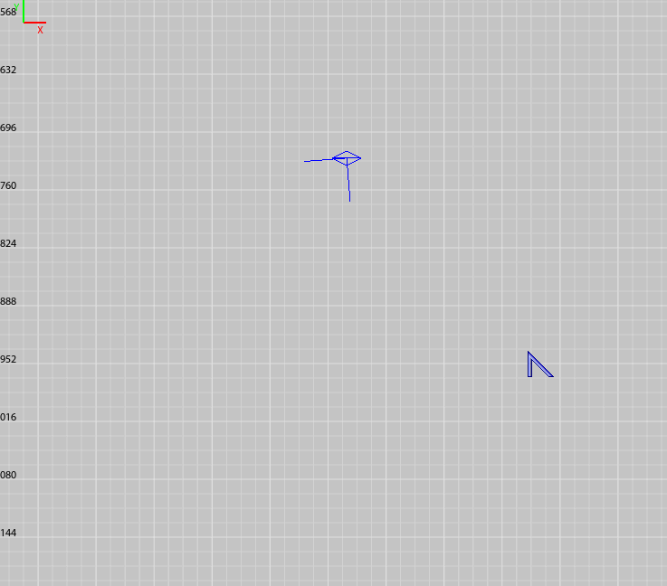

 
 

<h3 id="Snap selection bbox corner to pointed position in scene (m1 + ctrl)">
    <a href="#Snap selection bbox corner to pointed position in scene (m1 + ctrl)">
        Snap selection bbox corner to pointed position in scene (m1 + ctrl)
    </a>
</h3>

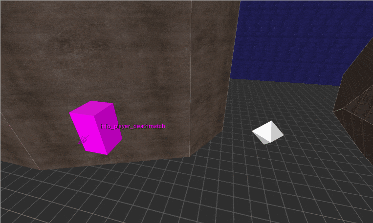

 
 

<h3 id="BBox rotate-snap (m1 + alt + ctrl), move along plane (m1 + ctrl + shift)">
    <a href="#BBox rotate-snap (m1 + alt + ctrl), move along plane (m1 + ctrl + shift)">
        BBox rotate-snap (m1 + alt + ctrl), move along plane (m1 + ctrl + shift)
    </a>
</h3>

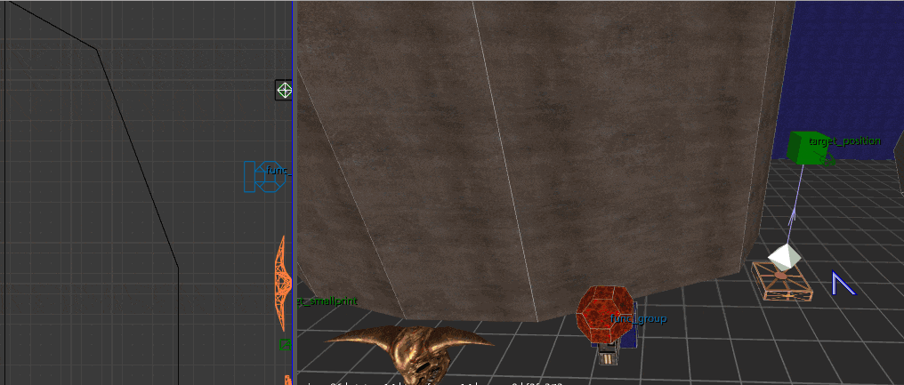

 
 

<h3 id="Creating brush arch via CSG Tool and texturing it simply by seamless texture paste">
    <a href="#Creating brush arch via CSG Tool and texturing it simply by seamless texture paste">
        Creating brush arch via CSG Tool and texturing it simply by seamless texture paste
    </a>
</h3>

<iframe width="990" height="560" src="https://www.youtube.com/embed/qA9eNOkD1iY" frameborder="0" allow="accelerometer; autoplay; clipboard-write; encrypted-media; gyroscope; picture-in-picture" allowfullscreen></iframe>

 
 

<h3 id="Creating Brush Spiral Staircase and Texturing it">
    <a href="#Creating Brush Spiral Staircase and Texturing it">
        Creating Brush Spiral Staircase and Texturing it
    </a>
</h3>

<iframe width="990" height="560" src="https://www.youtube.com/embed/QeiDOeAwAkw" frameborder="0" allow="accelerometer; autoplay; clipboard-write; encrypted-media; gyroscope; picture-in-picture" allowfullscreen></iframe>

